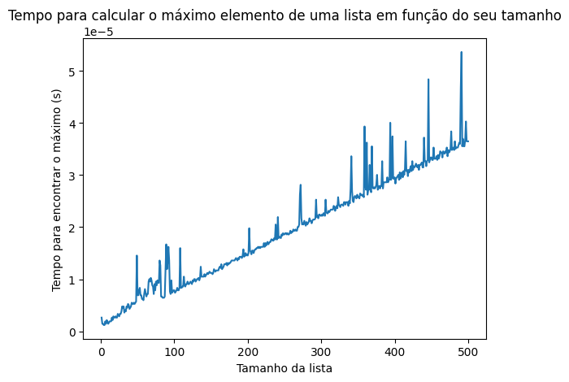

# AED2
Repositório criado no âmbito da turma 2024.1 da disciplina Algoritmos e Estruturas de Dados II, do bacharelado em Engenharia de Computação na UFRN. Essa disciplina dá continuidade ao estudo de diferentes estruturas de dados e seus algoritmos, com foco em Grafos. Na disciplina serão abordados os seguintes assuntos:
- Recursividade, Árvores Binárias e de Busca
- Complexidade de Algoritmos
- Fundamentos de grafos
- Teoria do Mundo Pequeno
- Visualização de dados usando Gephi
- Projetos temáticos: fluxo de dados, redes de infraestrutura e redes dirigidas
- Estudos de caso: análise cientométrica, redes sociais e mobilidade
## Autor
Meu nome é Juscelino Pereira de Araujo e eu sou aluno do bacharelado em Engenharia de Computação na UFRN desde 2023. Meus principais interesses de pesquisa envolvem Matemática Fuzzy, Aprendizagem Estatística e Problemas Inversos. Você pode me encontrar no Linkedin neste [link](https://www.linkedin.com/in/juscelino-pereira-de-ara%C3%BAjo-6279b5102/).
## Projetos
A seguir estão descritos os projetos desenvolvidos na disciplina. Ao longo do semestre esse arquivo será atualizado conforme o andamento da disciplina.
### Autocompletamento de palavras
Nesse projeto é construída uma ferramenta de autocompletamento de palavras a partir de um prefixo. O corpus textual utilizado foi uma tradução em português da Bíblia disponibilizada no seguinte [link](https://umsocorpo.com.br/downloads/biblia-sagrada-em-txt-versao-revista-e-corrigida/). Um notebook explicativo pode ser encontrado na pasta U1T1 deste repositório sob o título `AED2_U1T!_Juscelino.ipynb`. Uma aplicação no Streamlit foi elaborada para uso da ferramenta. A aplicação consome o arquivo `AED_U1T1_Juscelino.py`, que é uma adaptação do notebook para consumo do Streamlit. A aplicação pode ser acessada neste [link](https://aed2u1t1juscelinopy-ypeqed5cgf88bwn5vappwa9.streamlit.app/). Um vídeo com os principais detalhes do funcionamento do autocompletamento pode ser encontrado [aqui](https://www.loom.com/share/c4374ed115854212b73ee64d57877622?sid=078f5209-5488-4a3e-bd82-1e8675f3d3d8).

### Exercícios de complexidade de tempo de algoritmos

Para aprofundar os estudos relacionados à complexidade de tempo de algoritmos, bem como entender melhor como a linguagem Python realiza algumas operações envolvendo listas, alguns exercícios foram resolvidos a partir de dois notebooks contidos na pasta U1T2 deste repositório. Dentre os exercícios presentes, temos a avaliação do tempo de execução de uma função para encontrar elementos máximos de uma lista de inteiros. Na imagem abaixo, temos o resultado de um experimento em que a cada passo é gerada uma lista aleatória de inteiros de tamanho indo de 1 até 500.

Um breve vídeo explicativo sobre os exercícios pode ser visto [aqui](https://www.loom.com/share/47663a9688ef4c26b513e8fe4a19776f?sid=44cdaec6-303b-41ca-89c1-8a6bf3b11f40)

### Desafios sobre complexidade logarítmica

Ainda no âmbito da complexidade de tempo de algoritmos, foram propostos alguns desafios relacionados à busca em Árvores Binárias de Busca -- árvores BST, do inglês *Binary Search Tree*. A grande vantagem desse tipo de estrutura é que o processo de busca de um elemento vai custar um tempo proporcional à altura da árvore, que vai ser da ordem de $log_2(n)$. O [primeiro desafio](https://github.com/juscelinoaraujo/aed2/blob/main/U1T3/challenge_01_closestvalue%5BJuscelino%5D.ipynb) consistia em desenvolver uma função que recebesse uma árvore BST de números inteiros e um número inteiro "alvo" como parâmetros, e que retornasse o elemento da árvore mais próximo do alvo. Já o [segundo desafio](https://github.com/juscelinoaraujo/aed2/blob/main/U1T3/challenge_02_kth_largest%5BJuscelino%5D.ipynb) pedia o desenvolvimento de uma função que recebesse uma árvore BST de números inteiros e um número inteiro positivo $k$ como parâmetros, e retornasse o $k$-ésimo elemento mais alto da árvore.

Ambos os desafios foram desenvolvidos utilizando recursividade. Em cada caso, foi desenvolvida uma função, aqui chamada de $f_1$, que recebia, dentre outros parâmetros, um nó da árvore. Assim, a função determinava o que deveria ser feito em um caso base e como chamar a função recursivamente. Essa primeira função era chamada por outra, $f_2$, mais simples, que recebia a árvore BST como parâmetro e aplicava a função $f_1$ ao nó raiz da árvore. Os detalhes de cada implementação podem ser conferidos na pasta [U1T3](https://github.com/juscelinoaraujo/aed2/tree/main/U1T3) e uma breve explicação em vídeo das soluções pode ser encontrada [aqui]().  
